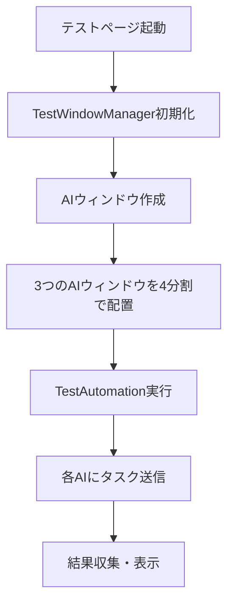

# AutoAI テストアーキテクチャ

## 概要
AutoAI拡張機能のテストシステムは、ChatGPT、Claude、Geminiの3つのAIサービスと統合して動作確認を行うための包括的なテストフレームワークです。

## テストシステムの構成

### 1. コアコンポーネント

```
11.autoai/
├── tests/                          # テスト関連ファイル
│   ├── test-ai-simple-working-fixed.html   # メインテストUI
│   ├── test-ai-simple-working-fixed.js     # メインテスト実装
│   └── *.html                             # その他のテストページ
├── src/
│   └── ui/
│       ├── test-window-manager.js   # テストウィンドウ管理
│       └── test-automation.js       # 自動テスト実行エンジン
└── background.js                    # バックグラウンドサービス
```

### 2. テストフロー



### 3. 主要クラス・モジュール

#### TestWindowManager
- **役割**: AIウィンドウの作成と管理
- **機能**:
  - ウィンドウの4分割配置（左上、右上、左下）
  - Chrome APIを使用したウィンドウ操作
  - ウィンドウ状態の追跡

#### TestAutomation
- **役割**: 自動テストの実行
- **機能**:
  - 各AIへのタスク送信
  - 結果の収集と分析
  - タイミング測定

#### AI Content Script (ai-content-unified.js)
- **役割**: 各AIサイトでの操作実行
- **機能**:
  - プロンプト入力
  - 送信ボタンクリック
  - 回答取得

### 4. メッセージフロー

1. **テストページ → Background.js**
   - `createTestWindow`: ウィンドウ作成要求
   - `executeTask`: タスク実行要求

2. **Background.js → Content Script**
   - `executeTask`: タスク実行指示
   - タブIDを使用した直接通信

3. **Content Script → Background.js**
   - タスク実行結果の返信
   - エラー情報の通知

### 5. ウィンドウ配置

画面を4分割して3つのAIウィンドウを配置:

```
+----------------+----------------+
|                |                |
|   ChatGPT      |    Claude      |
|   (左上)       |    (右上)      |
|                |                |
+----------------+----------------+
|                |                |
|   Gemini       |    未使用      |
|   (左下)       |                |
|                |                |
+----------------+----------------+
```

### 6. テストの種類

1. **統合テスト** (`test-ai-simple-working-fixed.html`)
   - 3つのAI同時テスト
   - プロンプト送信から回答取得まで

2. **個別機能テスト**
   - モデル選択テスト
   - ストリーミング処理テスト
   - UI操作テスト

### 7. ログシステム

- **AI別ログ**: 各AIの処理を個別に追跡
- **タイミング測定**: 各ステップの実行時間を記録
- **エラー追跡**: 失敗箇所の特定

### 8. 設定とカスタマイズ

- **タイムアウト設定**: 3分（180000ms）
- **ウィンドウタイプ**: popup（ブックマークバーなし）
- **並列実行**: Promise.allSettledを使用

## トラブルシューティング

### よくある問題
1. **Content Script接続エラー**
   - 原因: ページ読み込み前の通信試行
   - 解決: waitForWindowReadyで準備完了を待つ

2. **ウィンドウアクティブ化失敗**
   - 原因: Chrome APIの制限
   - 解決: focused: falseでバックグラウンド実行

3. **ログ出力の欠落**
   - 原因: Promise処理のタイミング
   - 解決: デバッグログの追加