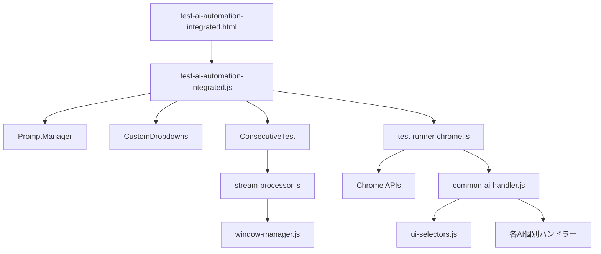

# 統合AIテストシステム ドキュメント

## 📋 概要

統合AIテストシステムは、複数のAIサービス（ChatGPT、Claude、Gemini、Genspark）を同時に制御し、自動化テストを実行するChrome拡張機能です。

## 🏗️ システム構成

### ファイル構成と依存関係

```
tests/integration/
├── test-ai-automation-integrated.html  # メインUI画面
├── test-ai-automation-integrated.js    # コアロジック実装
├── test-log-toggle-manager.js         # ログ管理システム
└── README.md                           # このドキュメント

automations/
├── test-runner-chrome.js               # Chrome拡張連携
├── common-ai-handler.js                # AI共通処理
├── chatgpt-automation.js               # ChatGPT専用処理
├── claude-automation-dynamic.js        # Claude専用処理
├── gemini-dynamic-automation.js        # Gemini専用処理
└── genspark-automation.js              # Genspark専用処理

src/
├── config/
│   └── ui-selectors.js                 # UIセレクタ定義
├── features/task/
│   ├── stream-processor.js             # 並列処理エンジン
│   ├── generator.js                    # タスク生成
│   └── models.js                       # データモデル
└── utils/
    └── window-manager.js               # ウィンドウ管理
```

### 依存関係図



## 🚀 主要機能

### 1. プロンプト管理機能

LocalStorageを使用した永続的なプロンプト管理システム

**機能詳細:**
- 最大20個までのプロンプト保存
- AI別のプロンプト管理
- 重複チェック機能
- 削除・編集機能

**使用方法:**
```javascript
// プロンプトの保存
PromptManager.savePrompt('chatgpt', 'テストプロンプト');

// プロンプトの取得
const prompts = PromptManager.getPrompts('chatgpt');

// プロンプトの削除
PromptManager.deletePrompt('chatgpt', 'テストプロンプト');
```

### 2. カスタムドロップダウンUI

動的なプロンプト選択インターフェース

**特徴:**
- リアルタイム更新
- 視覚的フィードバック
- ホバーエフェクト
- インライン削除ボタン

### 3. 3連続テスト機能

複数AIの並列テスト実行

**処理フロー:**
1. チェックボックスで有効AIを選択
2. テストプロンプトを自動生成
3. StreamProcessorで並列実行
4. 結果を統合表示

**設定可能項目:**
- テストプロンプト（3種類）
- 実行回数
- ウィンドウ配置

## 🔧 セットアップ

### 必要条件

- Chrome ブラウザ（バージョン88以降）
- Chrome拡張機能の開発者モード
- 各AIサービスのアカウント

### インストール手順

1. **拡張機能の読み込み**
   ```
   1. Chromeで chrome://extensions/ を開く
   2. 「開発者モード」を有効化
   3. 「パッケージ化されていない拡張機能を読み込む」をクリック
   4. プロジェクトのルートディレクトリを選択
   ```

2. **AIサービスへのログイン**
   - [ChatGPT](https://chatgpt.com)
   - [Claude](https://claude.ai)
   - [Gemini](https://gemini.google.com)
   - [Genspark](https://genspark.ai)

3. **テストページを開く**
   ```
   拡張機能アイコンをクリック → 「統合テスト」を選択
   ```

## 📖 使用方法

### 基本的な使い方

1. **AI選択**
   - チェックボックスで使用するAIを選択
   - 各AIのモデルと機能を設定

2. **プロンプト設定**
   - テキストボックスに直接入力
   - またはドロップダウンから選択
   - ➕ボタンで新規保存

3. **テスト実行**
   - 「テスト実行」ボタンをクリック
   - ログウィンドウで進行状況を確認

### 3連続テストの実行

1. **準備**
   ```javascript
   // ドロップダウンから「3連続テスト」を選択
   // または以下をコンソールで実行
   handleConsecutiveTest('chatgpt-prompt');
   ```

2. **実行**
   ```javascript
   // 「テスト実行」ボタンをクリック
   // またはコンソールで実行
   window.executeConsecutiveTest();
   ```

## 🛠️ トラブルシューティング

### よくある問題と解決方法

| 問題 | 原因 | 解決方法 |
|------|------|----------|
| AIが応答しない | セレクタの変更 | ui-selectors.jsを更新 |
| プロンプトが保存されない | LocalStorage制限 | 古いプロンプトを削除 |
| ウィンドウが開かない | ポップアップブロック | Chrome設定で許可 |
| ログが表示されない | コンソールエラー | デベロッパーツールで確認 |

### デバッグ方法

1. **コンソールログの確認**
   ```javascript
   // デベロッパーツールを開く（F12）
   console.log(window.consecutiveTestStates);
   console.log(PromptManager.getPrompts('chatgpt'));
   ```

2. **手動実行テスト**
   ```javascript
   // 個別機能のテスト
   PromptManager.savePrompt('test', 'デバッグ用プロンプト');
   setupCustomDropdowns();
   ```

## 📊 パフォーマンス

### 推奨設定

- **並列実行数**: 最大4AI
- **タイムアウト**: 30秒/リクエスト
- **リトライ回数**: 3回
- **ウィンドウサイズ**: 1920x1080以上

### メモリ使用量

- 基本使用量: 約50MB
- AI当たり追加: 約20MB
- ログ保存: 最大10MB

## 🔐 セキュリティ

### データ保護

- プロンプトはLocalStorageに保存
- APIキーは保存しない
- 通信はHTTPS経由

### 権限

必要な権限（manifest.json）:
- tabs: タブ操作
- storage: データ保存
- scripting: スクリプト注入
- identity: OAuth認証

## 🤝 貢献

### 開発ガイドライン

1. **コーディング規約**
   - ESLint設定に従う
   - JSDocコメントを記載
   - 関数は単一責任原則

2. **テスト**
   - 単体テストを追加
   - 統合テストを実行
   - 4つ以上のAIでテスト

3. **プルリクエスト**
   - feature/ブランチから作成
   - レビュー必須
   - CIパス必須

## 📄 ライセンス

MIT License - 詳細はLICENSEファイルを参照

## 📞 サポート

- Issues: [GitHub Issues](https://github.com/your-repo/issues)
- Email: support@autoai.dev
- Discord: [AutoAI Community](https://discord.gg/autoai)

---

最終更新: 2024年12月
バージョン: 1.0.0